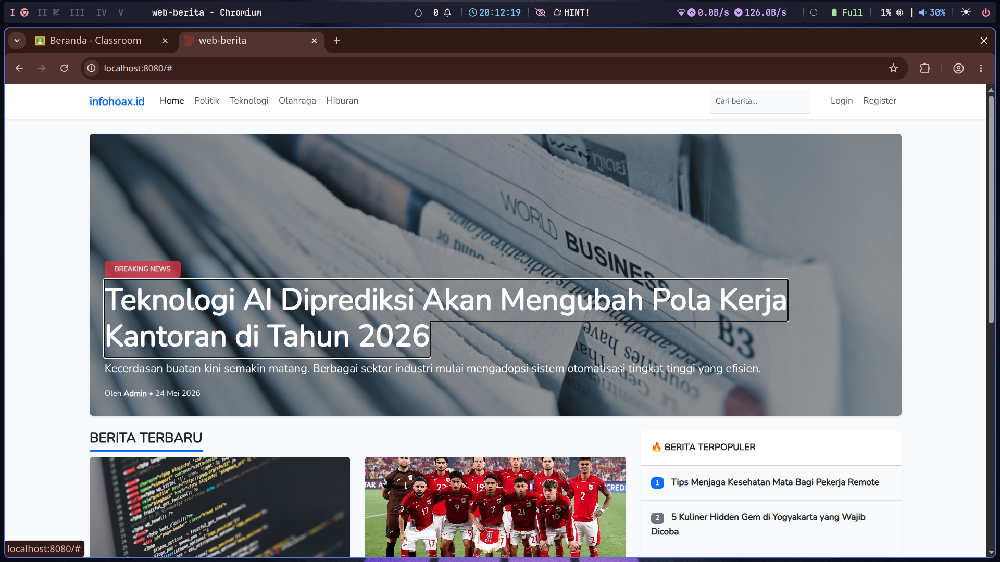
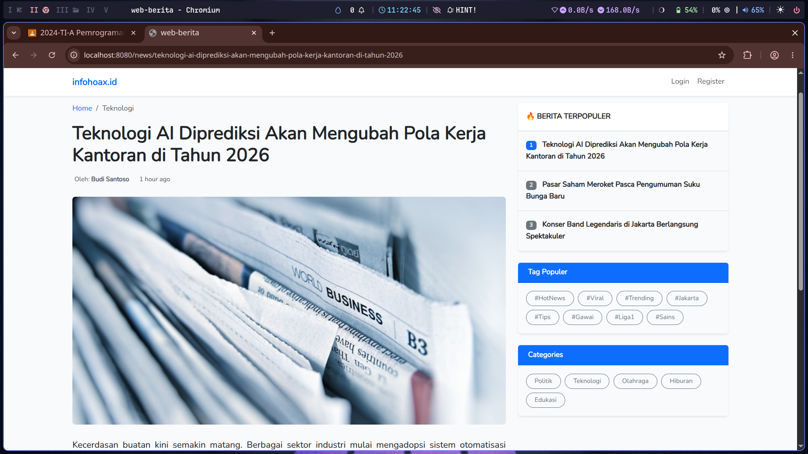
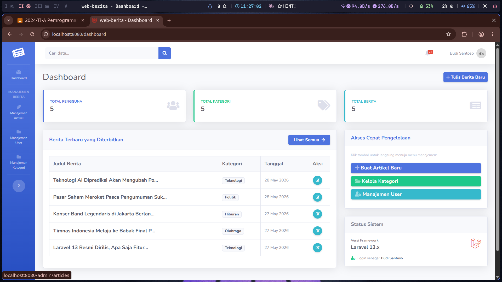
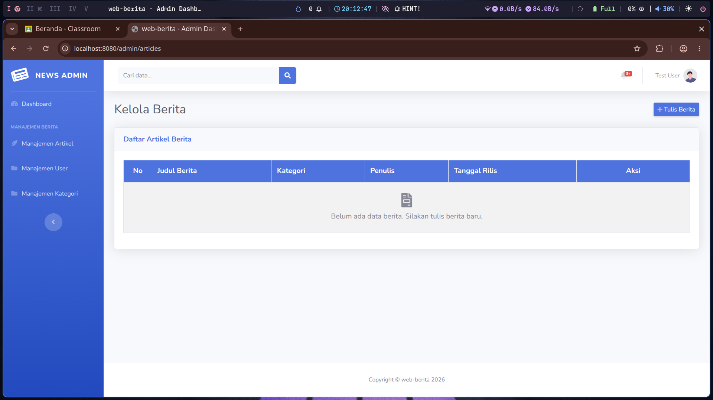
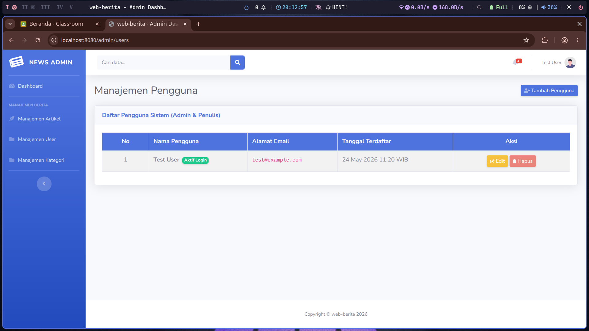
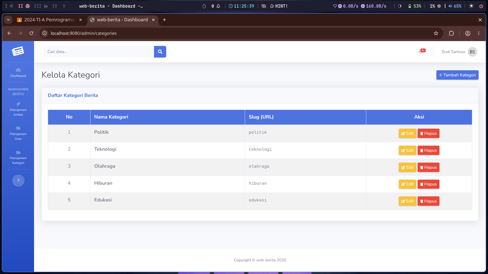

<p align="center"><a href="https://laravel.com" target="_blank"></a></p>

# 📰 Web Berita — Praktikum 14

> **Implementasi CRUD Dasar pada Web Berita**
> Membangun fondasi database, migrasi tabel, model relasional, controller terstruktur, dan antarmuka admin modular menggunakan **Laravel 13** + **SB Admin 2**.

---

## 📋 Deskripsi Proyek

Proyek ini merupakan aplikasi **CMS Web Berita** berbasis Laravel 13 yang dijalankan menggunakan **Laravel Sail** (Docker). Panel admin dibangun di atas template Bootstrap **SB Admin 2**. Praktikum ini berfokus pada implementasi CRUD (Create, Read, Update, Delete) untuk empat entitas utama: **Pengguna**, **Kategori**, **tags**, dan **Artikel Berita**, beserta relasi antar-tabel menggunakan Eloquent ORM.

---

### Home


### Detail


### Dashboard


### Kelola Artikel


### Kelola User


### Kelola Kategori


---

## ✨ Fitur Utama

- 🔐 **Autentikasi** — Login & Register bawaan Laravel UI
- 👤 **CRUD Pengguna** — Tambah, tampil, edit, hapus akun admin/penulis (dengan password hashing & proteksi self-delete)
- 🏷️ **CRUD Kategori** — Manajemen kategori berita dengan auto-generate slug
- 📝 **CRUD Artikel** — Penulisan berita dengan relasi ke kategori dan penulis
- 📊 **Dashboard Admin** — Statistik total pengguna, kategori, dan berita; tabel 5 berita terbaru
- 🔒 **Proteksi Route** — Semua halaman admin dilindungi middleware `auth`

---

## 🗄️ Skema Database

```
USERS ──── has one ──── PROFILES
  │
  └──── has many ──── ARTICLES ──── has many ──── CATEGORIES
                          │
                          └──── belongs to many ──── ARTICLE_TAG ──── belongs to many ──── TAGS
```

---

## ⚙️ Persyaratan Sistem

| Komponen   | Versi         |
|------------|---------------|
| PHP        | 8.3 (via Sail)|
| Laravel    | 13.x          |
| Composer   | 2.x           |
| Node.js    | 18.x          |
| Docker     | 20.x+         |
| PostgreSQL | 18 (via Sail) |

---

## 🚀 Cara Instalasi & Menjalankan

### 1. Clone / Ekstrak Proyek

```bash
unzip praktikum-14.zip
cd praktikum-14
```

### 2. Install Dependensi PHP

```bash
composer install
```

### 3. Konfigurasi Environment

```bash
cp .env.example .env
php artisan key:generate
```

Pastikan konfigurasi berikut ada di file `.env` (sudah sesuai untuk Sail):

```env
APP_NAME=web-berita
APP_URL=http://localhost:8080
APP_PORT=8080

DB_CONNECTION=pgsql
DB_HOST=pgsql
DB_PORT=5432
DB_DATABASE=praktikum-14
DB_USERNAME=root
DB_PASSWORD=root
```

### 4. Jalankan Laravel Sail (Docker)

```bash
# Jalankan container di background
./vendor/bin/sail up -d
```

> **Pertama kali?** Jika muncul error karena image belum ada, jalankan `./vendor/bin/sail build` terlebih dahulu.

### 5. Jalankan Migrasi

```bash
./vendor/bin/sail artisan migrate
```

### 6. Install & Build Aset Frontend

```bash
./vendor/bin/sail npm install
./vendor/bin/sail npm run build
```

Akses aplikasi di: **http://localhost:8080**

### 7. Menghentikan Sail

```bash
./vendor/bin/sail down
```

---

## 💡 Alias Sail (Opsional)

Agar tidak perlu mengetik `./vendor/bin/sail` setiap saat, tambahkan alias ke shell Anda:

```bash
# Tambahkan ke ~/.bashrc atau ~/.zshrc
alias sail='./vendor/bin/sail'

# Setelah itu reload shell
source ~/.bashrc
```

Penggunaan setelah alias aktif:

```bash
sail up -d
sail artisan migrate
sail artisan tinker
sail down
```

## 🔑 Akses Default

Buat akun pertama melalui halaman registrasi:

```
URL Login    : http://localhost:8080/login
URL Register : http://localhost:8080/register
Dashboard    : http://localhost:8080/dashboard
```

---

## 📌 Validasi Form

### Pengguna
- `name` — wajib, maks. 255 karakter
- `email` — wajib, format email, unik
- `password` — wajib (saat buat), min. 8 karakter, harus dikonfirmasi

### Kategori
- `name` — wajib, maks. 255 karakter, unik
- `slug` — digenerate otomatis dari nama menggunakan `Str::slug()`

### Artikel
- `title` — wajib, maks. 255 karakter
- `category_id` — wajib, harus ada di tabel `categories`
- `content` — wajib

---

## 📝 Lisensi

Proyek ini dibuat untuk keperluan **praktikum akademik** — Pemrograman Web Dasar, Tahun Ajaran 2025/2026.
